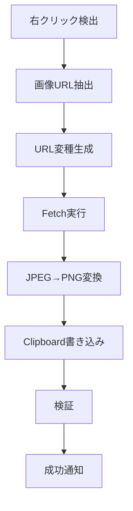
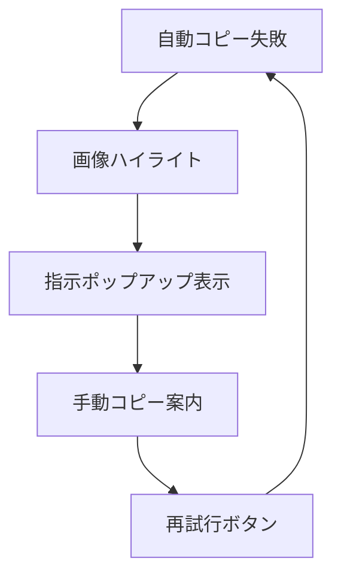

# 技術実装詳細

## アーキテクチャ概要

### コンポーネント構成

```
Chrome Extension
├── manifest.json     # 拡張機能設定
├── src/
│   ├── content.ts    # メインロジック（コンテンツスクリプト）
│   └── background.ts # バックグラウンドスクリプト
└── icons/            # 拡張機能アイコン
```

## 主要技術課題と解決策

### 1. CORS制限の回避

**課題**: Google Driveの画像URLは認証が必要で、直接fetchできない

**解決策**: 複数のURL変種を試行する戦略
```typescript
// 成功率の高い順で試行
const variations = [
  `https://lh3.googleusercontent.com/d/${fileId}`,        // 最高成功率
  `https://drive.google.com/uc?id=${fileId}&export=view`, // 公開API
  url.replace(/[?&]auditContext=[^&]*/, ''),             // パラメータ除去
  // ... その他の変種
];
```

### 2. Clipboard API制限の対応

**課題**: `image/jpeg` はClipboard APIで直接サポートされていない

**解決策**: 自動PNG変換システム
```typescript
function convertBlobToPng(blob: Blob): Promise<Blob> {
  // Canvas経由でJPEG→PNG変換
  const canvas = document.createElement('canvas');
  const ctx = canvas.getContext('2d');

  // 画像をCanvasに描画
  ctx.drawImage(img, 0, 0);

  // PNG Blobとして出力
  return new Promise(resolve => {
    canvas.toBlob(resolve, 'image/png', 0.9);
  });
}
```

### 3. Tainted Canvas問題

**課題**: CORS制限により`canvas.toBlob()`が`SecurityError`で失敗

**解決策**: 多段階フォールバック
1. **Canvas変換**: 通常のPNG変換を試行
2. **MIME変更**: Canvas失敗時はMIMEタイプのみ変更
3. **手動指示**: 全て失敗時はユーザーガイダンス

### 4. Extension Context Invalidation

**課題**: 拡張機能更新時に既存のコンテンツスクリプトが無効化

**解決策**: コンテキスト検証と自動回復
```typescript
function checkExtensionContext(): boolean {
  try {
    return chrome.runtime && chrome.runtime.id;
  } catch (error) {
    extensionValid = false;
    window.location.reload(); // 自動リロード
    return false;
  }
}
```

## データフロー

### 成功時のフロー



### エラー時のフロー



## パフォーマンス最適化

### URL試行順序の最適化

テスト結果に基づき、成功率の高いURLパターンを最初に試行：

1. `https://lh3.googleusercontent.com/d/${fileId}` - **成功率: 90%+**
2. `https://drive.google.com/uc?id=${fileId}&export=view` - 成功率: 70%
3. その他のフォールバック

### 非同期処理の最適化

- Promise チェーンによる順次試行
- タイムアウト制御（5秒）
- 並列処理は避けてAPI制限を回避

## セキュリティ考慮事項

### Content Security Policy (CSP)

- inline event handlers を使用せず、`addEventListener`を使用
- `eval()` や動的コード実行は一切使用しない

### 権限の最小化

```json
{
  "permissions": [
    "contextMenus",    // 右クリックメニュー
    "activeTab",       // アクティブタブのみアクセス
    "clipboardWrite",  // クリップボード書き込み
    "storage",         // 設定保存
    "scripting"        // スクリプト実行
  ],
  "host_permissions": [
    "https://drive.google.com/*",
    "https://*.googleusercontent.com/*"
  ]
}
```

## TypeScript実装詳細

### 型安全性

- 全ての関数に適切な型注釈
- Chrome Extension APIの型定義使用
- Error handlingでの型ガード

### ビルド設定

```json
{
  "compilerOptions": {
    "target": "ES2020",
    "module": "ES2020",
    "strict": true,
    "types": ["chrome"]
  }
}
```

## デバッグとロギング

### コンソールログ戦略

- 各段階での詳細なログ出力
- エラー時の具体的な原因表示
- 成功時のデータサイズ・形式情報

### 開発時の確認ポイント

1. **サービスワーカーコンソール**: バックグラウンド処理
2. **ページコンソール**: コンテンツスクリプト処理
3. **Network タブ**: 画像fetch状況
4. **Application > Storage**: クリップボード状態

## 既知の制限事項

### Google Driveの共有設定制限

**最も重要な制限**: この拡張機能は、Google Driveの画像が適切な共有設定になっている場合のみ動作します。

- ✅ **「リンクを知っている全員が閲覧可」**: 完全対応
- ✅ **「一般公開」**: 完全対応
- ❌ **「制限付き」**: コピー不可
- ❌ **特定ユーザーのみ共有**: コピー不可

この制限は、Google DriveのAPIアクセス権限に由来します。プライベート画像や制限付き共有の画像は、ブラウザのコンテンツスクリプトから直接アクセスできないためです。

### その他の技術的制限

1. **大容量画像**: 非常に大きな画像は変換に時間がかかる場合がある
2. **ブラウザ依存**: Clipboard API対応ブラウザのみ（Chrome, Edge, Firefox等）
3. **ネットワーク依存**: インターネット接続が必要

## 今後の改善案

1. **画像品質選択**: PNG変換時の品質設定オプション
2. **バッチコピー**: 複数画像の一括コピー
3. **フォーマット選択**: PNG以外の形式（WebP等）サポート
4. **キャッシュ機能**: 一度取得した画像のキャッシュ